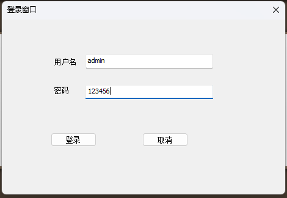
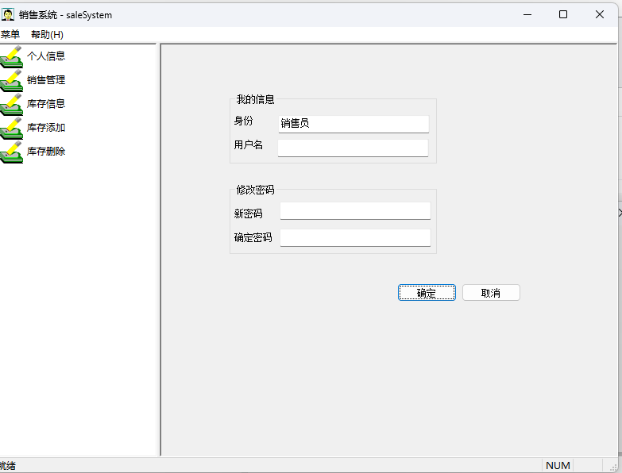
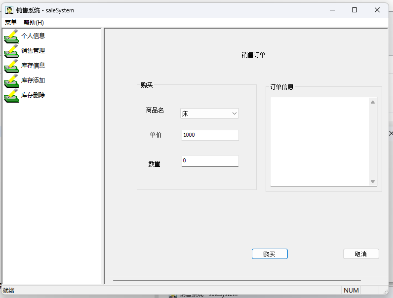
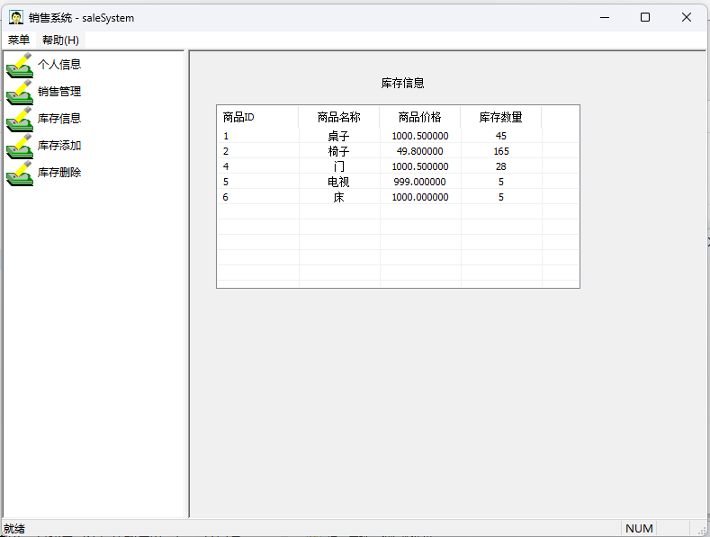
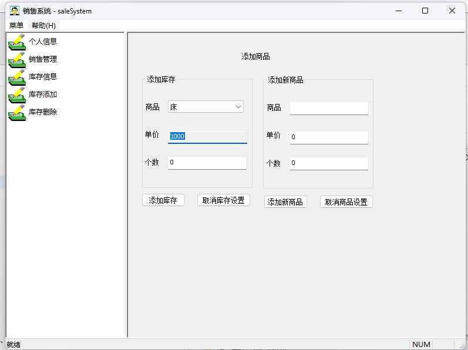
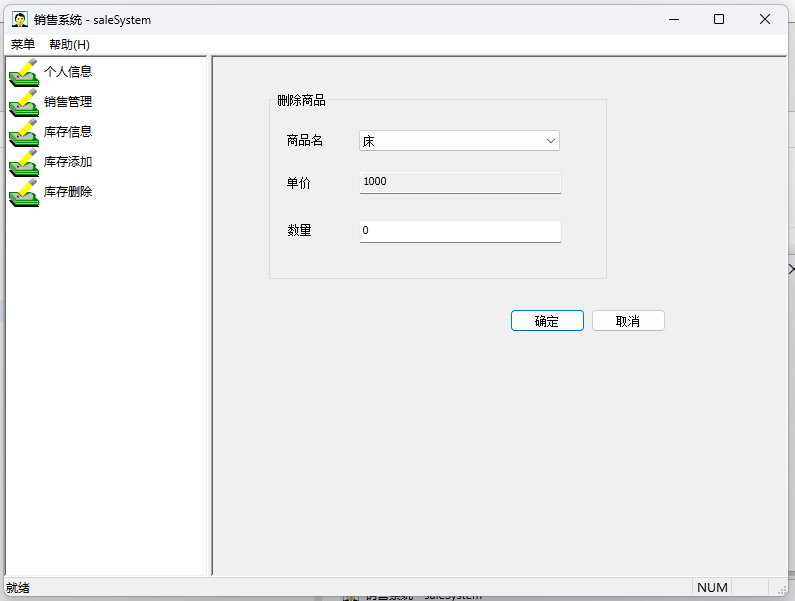

# saleSystem 销售系统：一个 MFC 和 SQLite 的 C++ 学习案例

2026/4/11  
这个项目是我 2025 年 3 月学习 MFC 时参考黑马程序员的视频教程写的，我额外添加了 SQLite 来作为数据库，完成项目过程的操作记录可以看我的博客：https://blog.iyatt.com/?p=19158  
当时学习 MFC 是为了给开发 AutoCAD 插件做准备的，结果原本计划的 AutoCAD 项目一直搁置到今年，上月中旬的时候才真正启动开发。不过时隔了一年，MFC 中的很多东西我都忘记了，所以才想起来翻翻当时学习的时候写的这个项目。原先是上传在百度网盘的，现在把它重新提交到 GitHub 上，更加方便查阅也可以帮到其它人作为参考。  
  
  
  
  
  
  

## 测试环境

* Windows 11
* Visual Studio 2022
* 编译标准：C++14
* MFC 开发环境准备：https://blog.iyatt.com/?p=18843
* SQLite 3.49.1 开发环境准备：https://blog.iyatt.com/?p=19187
